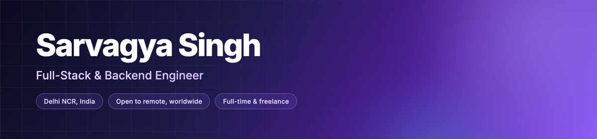
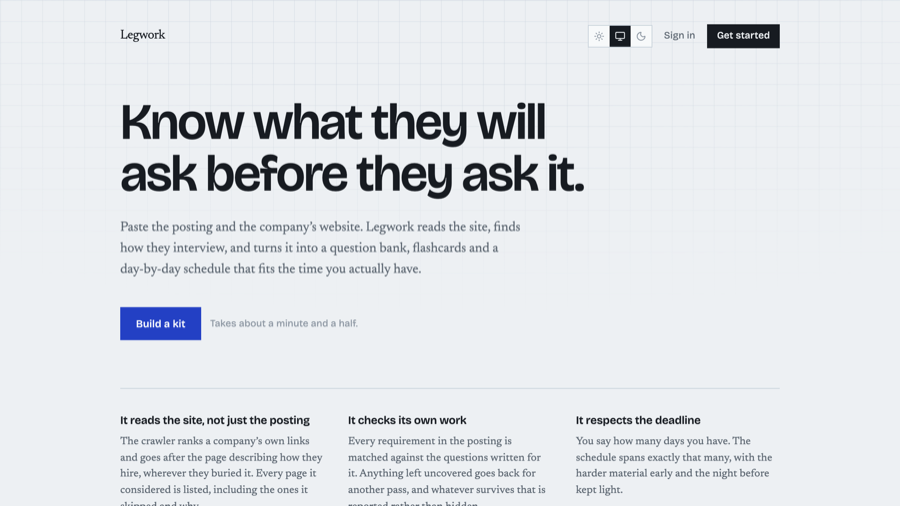
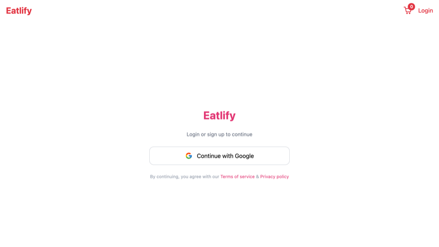
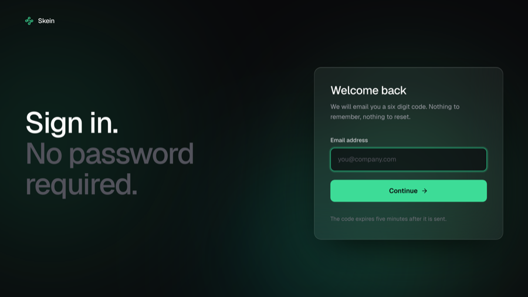
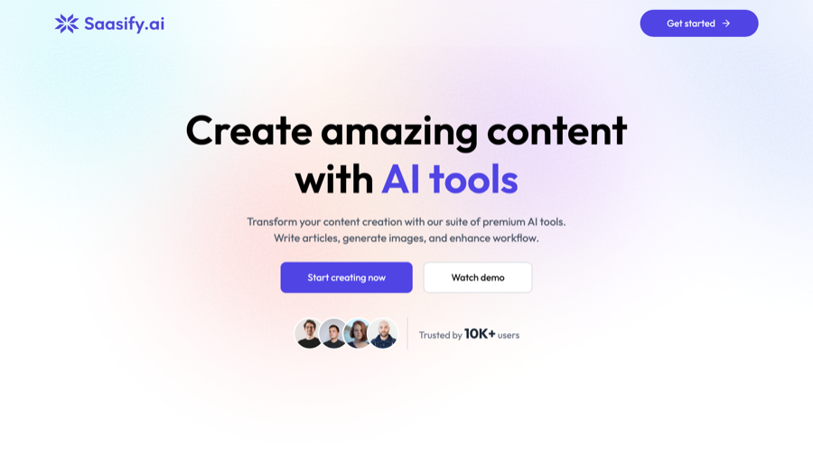
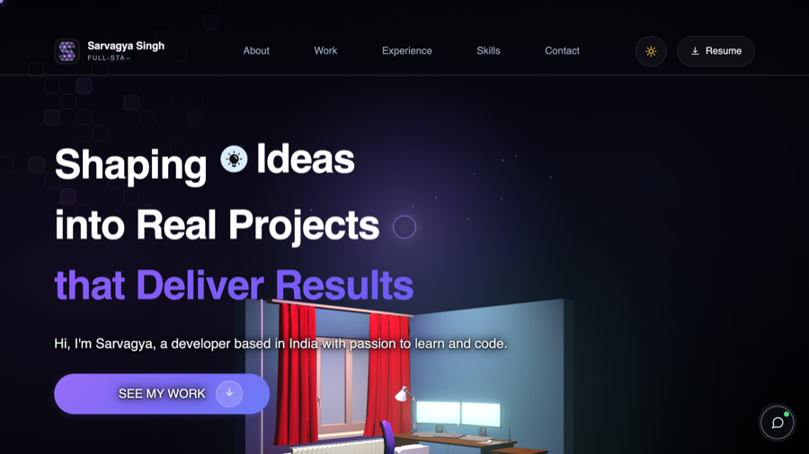
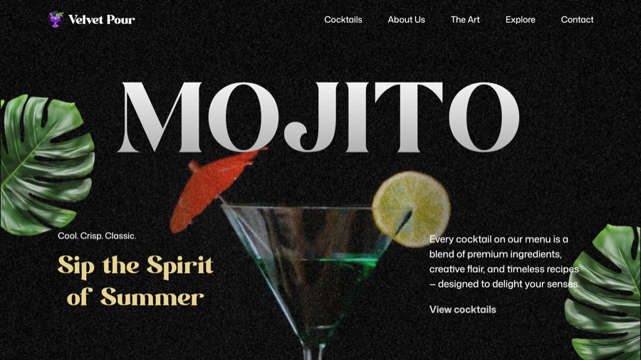

I build production web applications end to end — **event-driven backends, real-time systems,**
**and the interfaces that sit on top of them.**

 

## 🛠 &nbsp;What I build

**Backend and distributed systems** &nbsp;—&nbsp; REST APIs, services that talk over RabbitMQ instead of
blocking on each other, WebSocket real-time layers, payments with Razorpay and Stripe, and schema
and query design across PostgreSQL, MySQL and MongoDB.

**Frontend and product** &nbsp;—&nbsp; React and Next.js applications, Redux state architecture,
data-heavy dashboards and internal admin tools, and animation work with GSAP and Three.js when the
interface has to sell something.

**Getting it live** &nbsp;—&nbsp; Dockerised services behind nginx with TLS on cloud VMs, and Next.js
on Vercel. Every project below has a URL you can open right now.

 

 

## 🚀 &nbsp;Featured projects

<table cellpadding="16">
<tr>
<td width="50%" valign="top">

 

<h3>Legwork</h3>

<em>AI interview prep kit</em>

Turns a job posting and a company URL into a researched prep kit. The model must quote the span every requirement came from, and code verifies it really exists — anything unproven is discarded. Coverage is checked in code, not by a model.

  
 
 

</td>
<td width="50%" valign="top">

 

<h3>Eatlify</h3>

<em>Food ordering platform</em>

Six services coordinating one order, built so any of them can fail without taking the order with it. Retries, a dead-letter queue and health checks; Redis caching cut DB reads ~60%. Live rider tracking over Socket.IO, payments via Razorpay and Stripe.

  
 
 

</td>
</tr>
<tr>
<td width="50%" valign="top">

 

<h3>Skein</h3>

<em>Real-time chat</em>

Passwordless chat — sign in with an emailed OTP, then live messages, typing indicators and read receipts. Email is decoupled over RabbitMQ, failed sends land in a dead-letter queue with peek/replay/purge tooling, and Socket.IO scales through the Redis adapter.

  
   
 

</td>
<td width="50%" valign="top">

 

<h3>SaaSify&#8209;AI</h3>

<em>AI content platform</em>

A PERN-stack AI SaaS with article and image generation, plus a r&eacute;sum&eacute; scorer that reads an uploaded PDF and reports back against a role.

  
 
 

</td>
</tr>
<tr>
<td width="50%" valign="top">

 

<h3>Portfolio</h3>

<em>sarvagyasingh.space</em>

Next.js and React Three Fiber — a scroll-driven WebGL sequence, a theme that follows your local clock, and a Gemini-backed assistant that answers from a curated corpus instead of improvising.

  
 
 

</td>
<td width="50%" valign="top">

 

<h3>Velvet Pour</h3>

<em>Animated marketing site</em>

A cocktail bar landing page built to practise scroll-driven animation — pinned sections, timeline-sequenced reveals, and a responsive layout that reworks the choreography rather than just reflowing it.

  
 
 

</td>
</tr>
</table>

 

## 💼 &nbsp;Experience

### Kraftshala &nbsp;·&nbsp; Software Developer, Full-stack &nbsp;·&nbsp; Mar – Sep 2026 &nbsp;·&nbsp; Delhi

Six months owning features end to end on the internal operations platform a real
team used every day — **331 commits** across a Node/TypeScript/MySQL backend and a
React/Redux frontend.

The piece I'd most want to walk you through is a **self-service alerting
platform**. Teams define a SQL rule and a threshold through an API, a per-minute
cron evaluates them and posts to Google Chat. Because the SQL is user-supplied it
needed a validation layer that permits only `SELECT` and `WITH` and blocks DDL and
DML. A few months later another engineer shipped two of their own alert features
on top of it without needing me. That's the part I'm proud of — not the feature,
the fact that it became something someone else could build on.

Elsewhere on that platform: a **bulk Excel upload engine** that validates, parses
and deduplicates 1,000+ records per upload and cut the manual work by ~80%;
**Google OAuth 2.0 SSO** plus HTTP 409 conflict detection that stopped
double-bookings across the Zoom, CRM and payment integrations; and a **Placements
Opportunity Tracker** with transactional owner reassignment, a reusable audit log,
and a listing query rewritten from six subqueries down to one join.

I also broke production once: an SSO restriction I added locked some admins out of
password sign-in. I caught it and rolled it back inside 48 hours. I'd rather say
that up front than have you find it.

### BWS &nbsp;·&nbsp; Full-Stack Developer &nbsp;·&nbsp; Jul – Dec 2025 &nbsp;·&nbsp; Remote

My first fully remote role, maintaining a production website across frontend and
backend. I built and deployed an **AI chatbot** on the company site with the MERN
stack that handles 100+ visitor queries without a human, a **"Request a Callback"**
flow that syncs leads straight into Zoho CRM over REST (200 of them so far), and a
WhatsApp community integration. I also took the site from **~8s to ~2s** through
performance and on-page SEO work.

### Coding Blocks &nbsp;·&nbsp; Teaching Assistant &nbsp;·&nbsp; May – Aug 2024 &nbsp;·&nbsp; Noida

Mentored 100+ students through Java, data structures and algorithms in doubt
sessions and one-on-one code reviews. Reading other people's code that closely,
that often, is where I learned what actually makes code easy to follow.

<table>
<tr><td><b>~40s → ~400ms</b></td><td>Dashboard queries rebuilt around a deferred join, and the inflated pagination counts fixed with them &nbsp;Kraftshala</td></tr>
<tr><td><b>~2k → ~400k/day</b></td><td>Calendar-invite throughput, after decoupling event creation from delivery via AWS SES behind default-off feature flags &nbsp;Kraftshala</td></tr>
<tr><td><b>1,000+ rows</b></td><td>Per bulk Excel upload, validated before any write, processed through a Bull queue &nbsp;Kraftshala</td></tr>
<tr><td><b>~8s → ~2s</b></td><td>Page load on a production site, through performance and on-page SEO work &nbsp;BWS</td></tr>
</table>

 

Currently deepening **data structures, algorithms and system design**, and writing the systems above
up as proper case studies.

### Get in touch

